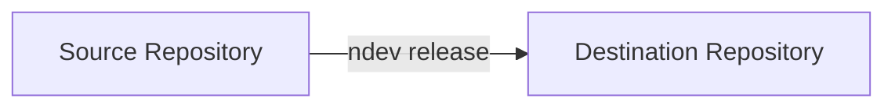

# ndev

ndev is an ultimate tool to manage development lifecycle.

- [managing releases](#release-management)
- _work in progress..._

To install `ndev` run:

```bash
uv tool install ndev
```

To update `ndev` run:

```bash
uv tool upgrade ndev
```

You can use it to install and debug:

```bash
git clone https://github.com/numdes/ndev 
cd ndev
uv tool install --editable .
```

## Release management

When you have a big repository with complicated structure, and you want to release it for
customers with a specific structure, you can use `ndev release` command.



Basic use case is to transfer some sources codes to another repository:

```bash
    ndev release \
        --origin . \
        --destination git@example.com:libs/example1.git \
        --author_name "$GITLAB_USER_NAME" \
        --author_email "$GITLAB_USER_EMAIL"
```

Here `--origin` is a path to the sources you want to release,
`--destination` is a path to the repository where you want to release the sources.

`--author_name` and `--author_email` are optional parameters that will be used
to set author of the commit in the destination repository.

After running this command, `ndev` will:

1. Wipe out all the files in the destination repository
2. Copy all the files from the origin repository to the destination repository
3. Commit all the changes

All configuration is stored in `pyproject.toml` in `tool.ndev` section. Config sample:

```toml
[tool.ndev]
# relative path in origin repository to be a root of the release in destination repository
release-root = "releases/customer-root"

# generate and copy requirements.txt
copy-requirements = true

# manage pyproject.toml 
manage-pyproject = true

# generate poetry lock after all steps
generate-poetry-lock = true

# generate and copy version.json
add-version-json = true

# list of files to be copied from origin to destination
copy-local = [
    { from = "example1", to = "services/example1" },
]

# list of wheels to be copied from origin dependecies to destination
copy-wheel-src = [
    # wheels sources for external use
    { from = "example2", to = "wheels/example2" },
    # ignore some files while copying
    { from = "example2", to = "wheels/example2", ignores = ["*.txt", "README.md"] },
    # specify platform for the wheel. This is useful when you run `ndev release` 
    # on a different platform than the one you want to release for.
    { from = "example2", to = "wheels/example2", platform = "manylinux_2_36_x86_64" },
]

# list of repositories to be copied to destination
# if repo has ndev configuration, it will use it recursively
copy-repo-src = [
    { from = "git@example.com:collction/example3.git", to = "libs/example3/cpp-src", ref = "main" },
]

# below is an example of how to copy a repository with specific package name and platform
# it uses custom configuration for package name to follow specific tag
[[tool.ndev.copy-repo-src]]
from = "git@example.com:repo/example4.git"
to = "libs/example4/cpp-src"
ref = "$NAME$-$VERSION$"
package_name = "some_package_name"
platform = "manylinux_2_36_x86_64"

# patch files before release
[[tool.ndev.patches]]
glob = "**/_extern/pybind11/**"
regex = "https?:\\/\\/[^\\s)'\"]+"
subst = "LINK-REMOVED-DUE-TO-SECURITY-REQUIREMENTS"

```
